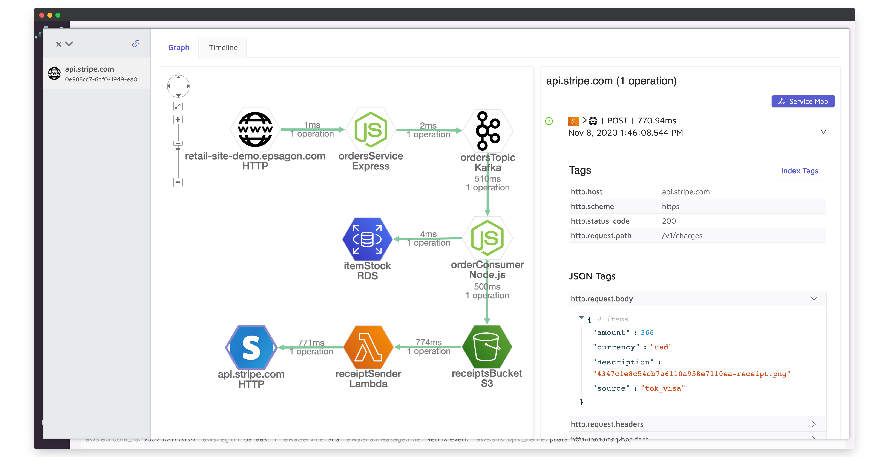

<p align="center">
  <a href="https://epsagon.com" target="_blank" align="center">
    
  </a>
  <br />
</p>

[](https://travis-ci.com/epsagon/epsagon-node)
[](https://badge.fury.io/js/epsagon)
[](https://github.com/semantic-release/semantic-release)

# Epsagon Tracing for Node.js




This package provides tracing to Node.js applications for the collection of distributed tracing and performance metrics in [Epsagon](https://app.epsagon.com/?utm_source=github).

## Contents

- [Installation](#installation)
- [Usage](#usage)
  - [Auto-tracing](#auto-tracing)
  - [Calling the SDK](#calling-the-sdk)
  - [Tagging Traces](#tagging-traces)
  - [Custom Errors](#custom-errors)
  - [Filter Sensitive Data](#filter-sensitive-data)
  - [Ignore Endpoints](#ignore-endpoints)
  - [Trace URL](#trace-url)
- [Frameworks](#frameworks)
- [Integrations](#integrations)
- [Configuration](#configuration)
- [Getting Help](#getting-help)
- [Opening Issues](#opening-issues)
- [License](#license)

## Installation

To install Epsagon, simply run:
```sh
npm install epsagon
```

## Usage
**Important: Epsagon is activated and instruments the supported libraries once the module is imported.**

### Auto-tracing

The simplest way to get started in some frameworks is to install `epsagon-frameworks`:
```sh
npm install epsagon-frameworks
```

[`epsagon-frameworks`](https://github.com/epsagon/epsagon-node-frameworks) extends the base `epsagon` support to more frameworks.

And run your node command:
```sh
export EPSAGON_TOKEN=<epsagon-token>
export EPSAGON_APP_NAME=<app-name-stage>
export NODE_OPTIONS='-r epsagon-frameworks'
<node command>
```

For example:
```sh
export EPSAGON_TOKEN=<your-token>
export EPSAGON_APP_NAME=express-prod
export NODE_OPTIONS='-r epsagon-frameworks'
node app.js
```

When using inside a `Dockerfile`, you can use `ENV` instead of `export`.

You can see the list of auto-tracing [supported frameworks](#frameworks)

### Calling the SDK

Another simple alternative is to copy the snippet into your code:
```javascript
const epsagon = require('epsagon-frameworks');

epsagon.init({
  token: 'epsagon-token',
  appName: 'app-name-stage',
  metadataOnly: false,
});
```

To run on your framework please refer to [supported frameworks](#frameworks)


### Tagging Traces

You can add custom tags to your traces, for easier filtering and aggregations.

Add the following call inside your code:
```javascript
epsagon.label('key', 'value');
epsagon.label('userId', userId);
```

You can also use it to ship custom metrics:
```javascript
epsagon.label('key', 'metric')
epsagon.label('itemsInCart', itemsInCart)
```

You can also set global labels as part of the Epsagon initialisation:
```javascript
epsagon.init({
  token: 'epsagon-token',
  appName: 'app-name-stage',
  labels: [['key', 'value'], ['userId', userId]],
});
```

Valid types are `string`, `boolean` and `number`.

In some [frameworks](#frameworks) tagging can be done in different ways.

### Custom Errors

You can set a trace as an error (although handled correctly) to get an alert or just follow it on the dashboard.

Add the following call inside your code:
```javascript
try {
  // something bad happens
} catch (err) {
  epsagon.setError(err);
}

// Or manually specify Error object
epsagon.setError(Error('My custom error'));
```

### Custom Warnings

This API allows you to flag the trace with a warning and also enables more flexible alerting

Add the following call inside your code:
```javascript
try {
  // something bad happens
} catch (err) {
  epsagon.setWarning(err);
}

// Or manually specify Error object
epsagon.setWarning(Error('My custom error'));
```

In some [frameworks](#frameworks) custom errors can be declared in different ways.

### Filter Sensitive Data

You can pass a list of sensitive properties and hostnames and they will be filtered out from the traces:

```javascript
epsagon.init({
  token: 'epsagon-token',
  appName: 'app-name-stage',
  metadataOnly: false,
  ignoredKeys: ['password', /.*_token$/],
  urlPatternsToIgnore: ['example.com', 'auth.com'],
});
```

The `ignoredKeys` property can contain strings (will perform a loose match, so that `First Name` also matches `first_name`), regular expressions, and predicate functions.
Also, you can set `urlPatternsToIgnore` to ignore HTTP calls to specific domains.


### Ignore Endpoints

You can ignore certain incoming requests by specifying endpoints:
```javascript
epsagon.ignoreEndpoints(['/healthcheck'])
```

### Trace URL

You can get the Epsagon dashboard URL for the current trace, using the following:
```node
# Inside some endpoint or function
console.log('Epsagon trace URL:', epsagon.getTraceUrl())
```

This can be useful to have an easy access the trace from different platforms.


## Frameworks

The following frameworks are supported by Epsagon.
Some require installing also [`epsagon-frameworks`](https://github.com/epsagon/epsagon-node-frameworks)

|Framework                               |Supported Version          |Epsagon Library                                    |Auto-tracing Supported                               |
|----------------------------------------|---------------------------|---------------------------------------------------|-----------------------------------------------------|
|[AWS Lambda](#aws-lambda)               |All                        |`epsagon`                                          |<ul><li>- [x] (Through the dashboard only)</li></ul> |
|[Step Functions](#step-functions)       |All                        |`epsagon`                                          |<ul><li>- [ ] </li></ul>                             |
|[OpenWhisk Action](#openwhisk-action)   |All                        |`epsagon`                                          |<ul><li>- [ ] </li></ul>                             |
|[AWS Batch](#aws-batch)                 |All                        |`epsagon`                                          |<ul><li>- [ ] </li></ul>                             |
|[Generic](#generic)                     |All                        |`epsagon`                                          |<ul><li>- [ ] </li></ul>                             |
|[Express](#express)                     |`>=3.0.0`                  |`epsagon-frameworks`                               |<ul><li>- [x] </li></ul>                             |
|[Hapi](#hapi)                           |`>=17.0.0`                 |`epsagon-frameworks`                               |<ul><li>- [x] </li></ul>                             |
|[Koa](#koa)                             |`>=1.1.0`                  |`epsagon-frameworks`                               |<ul><li>- [x] </li></ul>                             |
|[WS (Websocket)](#ws)                   |`>=7.3.1`                  |`epsagon-frameworks`                               |<ul><li>- [x] </li></ul>                             |
|[restify](#restify)                     |`>=7.0.0`                  |`epsagon-frameworks`                               |<ul><li>- [x] </li></ul>                             |
|[fastify](#fastify)                     |`>=3.0.0`                  |`epsagon-frameworks`                               |<ul><li>- [x] </li></ul>                             |
|[KafkaJS](#kafkajs)                     |`>=1.2.0`                  |`epsagon-frameworks`                               |<ul><li>- [x] </li></ul>                             |
|[kafka-node](#kafka-node)                     |`>=3.0.0`            |`epsagon-frameworks`                               |<ul><li>- [x] </li></ul>                             |
|[PubSub](#pubsub)                       |`>=1.1.0`                  |`epsagon-frameworks`                               |<ul><li>- [x] </li></ul>                             |
|[SQS Consumer](#sqs-consumer)           |`>=4.0.0`                  |`epsagon-frameworks`                               |<ul><li>- [x] </li></ul>                             |
|[amqplib](#amqplib)           |`>=0.5.0`                  |`epsagon-frameworks`                               |<ul><li>- [x] </li></ul>                             |
|[bunnybus](#bunnybus)           |`>=7.0.0`                  |`epsagon-frameworks`                               |<ul><li>- [x] </li></ul>                             |
|[NATS](#nats)                           |`>=1.4.0`                  |`epsagon-frameworks`                               |<ul><li>- [x] </li></ul>                             |


### AWS Lambda

Tracing Lambda functions can be done in three methods:
1. Auto-tracing through the Epsagon dashboard.
2. Using the [`serverless-plugin-epsagon`](https://github.com/epsagon/serverless-plugin-epsagon) if you're using The Serverless Framework.
3. Calling the SDK.

**Make sure to choose just one of the methods**

Calling the SDK is simple:

```javascript
const epsagon = require('epsagon');
epsagon.init({
  token: 'epsagon-token',
  appName: 'app-name-stage',
  metadataOnly: false,
});

// Wrap your entry point
module.exports.handler = epsagon.lambdaWrapper((event, context, callback) => {
  // Your code is here
});

// Async functions example
module.exports.handler = epsagon.lambdaWrapper(async (event) => {
  // Your code is here
});
```

### Step Functions

Tracing Step Functions is similar to regular Lambda functions, but the wrapper changes from `lambdaWrapper` to `stepLambdaWrapper`:

```javascript
const epsagon = require('epsagon');
epsagon.init({
  token: 'epsagon-token',
  appName: 'app-name-stage',
  metadataOnly: false,
});

// Wrap your entry point
module.exports.handler = epsagon.stepLambdaWrapper((event, context, callback) => {
  // Your code is here
});

// Async functions example
module.exports.handler = epsagon.stepLambdaWrapper(async (event) => {
  // Your code is here
});
```
ECS Step - You should pass Epsagon step_dict id from ECS state input into ```EPSAGON_STEPS_ID``` environment variables of the container, ```EPSAGON_STEPS_NUM``` is the step number of the ECS (default: 0). check the [configuration](https://github.com/epsagon/epsagon-node/#configuration) section.

### OpenWhisk Action

You should pass the Epsagon token to your action as a default parameter, so that you don't have to expose important credentials in your code.
The name of the parameter can be configured using `token_param`, in this example we use `epsagon-token`:

```javascript
const epsagon = require('epsagon');

function main(params) {
  // Your code is here
}

module.exports.main = epsagon.openWhiskWrapper(
  main,
  {
    token_param: 'epsagon-token', // name of the action parameter to take the token from
    appName: 'app-name-stage',
    metadataOnly: false
  }
);
```

### AWS Batch

Tracing batch jobs running in AWS Batch can be done by calling `epsagon.wrapBatchJob()` at the main handler/entrypoint of the code:

```javascript
const epsagon = require('epsagon');
epsagon.init({
  token: 'epsagon-token',
  appName: 'app-name-stage',
  metadataOnly: false,
  labels: [["key", "value"]],
  traceCollectorURL: "https://eu-central-1.tc.epsagon.com" // default region is us-east-1
});

epsagon.wrapBatchJob();

function process(params) {
  try {
    // your code here
  } catch (error) {
    // some other code here
    process.exitCode = 1; //exits gracefully
  }
}
```

### Express

Tracing Express application can be done in two methods:
1. [Auto-tracing](#auto-tracing) using the environment variable.
2. Calling the SDK.

Calling the SDK is simple, and should be done in your main `js` file where the application is being initialized:

```javascript
const epsagon = require('epsagon-frameworks');

epsagon.init({
  token: 'epsagon-token',
  appName: 'app-name-stage',
  metadataOnly: false,
});
```

Tagging traces or setting custom errors can be by:

```javascript
app.get('/', (req, res) => {
  req.epsagon.label('key', 'value');
  req.epsagon.setError(Error('My custom error'));
}
```

### Hapi

Tracing Hapi application can be done in two methods:
1. [Auto-tracing](#auto-tracing) using the environment variable.
2. Calling the SDK.

Calling the SDK is simple, and should be done in your main `js` file where the application is being initialized:

```javascript
const epsagon = require('epsagon-frameworks');

epsagon.init({
  token: 'epsagon-token',
  appName: 'app-name-stage',
  metadataOnly: false,
});
```

Tagging traces or setting custom errors can be by:

```javascript
server.route({
  method: 'GET',
  path:'/',
  handler: (request, h) => {
      request.epsagon.label('key', 'value');
      request.epsagon.setError(Error('My custom error'));
  }
});
```

### Koa

Tracing Koa application can be done in two methods:
1. [Auto-tracing](#auto-tracing) using the environment variable.
2. Calling the SDK.

Calling the SDK is simple, and should be done in your main `js` file where the application is being initialized:

```javascript
const epsagon = require('epsagon-frameworks');

epsagon.init({
  token: 'epsagon-token',
  appName: 'app-name-stage',
  metadataOnly: false,
});
```

Tagging traces or setting custom errors can be by:

```javascript
app.use(async ctx => {
  ctx.epsagon.label('key', 'value');
  ctx.epsagon.setError(Error('My custom error'));
});
```

### WS (Websocket)

Tracing `ws` consumers can be done in two methods:
1. [Auto-tracing](#auto-tracing) using the environment variable.
2. Calling the SDK.

Calling the SDK is simple, and should be done in your main `js` file where the consumer is being initialized:

```javascript
const epsagon = require('epsagon-frameworks');

epsagon.init({
  token: 'epsagon-token',
  appName: 'app-name-stage',
  metadataOnly: false,
});
```

Tagging traces or setting custom errors can be by:

```javascript
socket.on('message', (message) => {
    message.epsagon.label('key', 'value');
    message.epsagon.setError(Error('My custom error'));
}) 
```

### restify

Tracing restify application can be done in two methods:
1. [Auto-tracing](#auto-tracing) using the environment variable.
2. Calling the SDK.

Calling the SDK is simple, and should be done in your main `js` file where the application is being initialized:

```javascript
const epsagon = require('epsagon-frameworks');

epsagon.init({
  token: 'epsagon-token',
  appName: 'app-name-stage',
  metadataOnly: false,
});
```

Tagging traces or setting custom errors can be by:

```javascript
function respond(req, res, next) {
  req.epsagon.label('key', 'value');
  req.epsagon.setError(Error('My custom error'));
}
```

### fastify

Tracing fastify application can be done in two methods:
1. [Auto-tracing](#auto-tracing) using the environment variable.
2. Calling the SDK.

Calling the SDK is simple, and should be done in your main `js` file where the application is being initialized:

```javascript
const epsagon = require('epsagon-frameworks');

epsagon.init({
  token: 'epsagon-token',
  appName: 'app-name-stage',
  metadataOnly: false,
});
```

Tagging traces or setting custom errors can be by:

```javascript
fastify.get('/', (request, reply) => {
  request.epsagon.label('key', 'value');
  request.epsagon.setError(Error('My custom error'));
  reply.send({ hello: 'world' })
})
```

### KafkaJS

Tracing `kafkajs` consumers can be done in two methods:
1. [Auto-tracing](#auto-tracing) using the environment variable.
2. Calling the SDK.

Calling the SDK is simple, and should be done in your main `js` file where the consumer is being initialized:

```javascript
const epsagon = require('epsagon-frameworks');

epsagon.init({
  token: 'epsagon-token',
  appName: 'app-name-stage',
  metadataOnly: false,
});
```

Tagging traces or setting custom errors can be by:

```javascript
await consumer.run({
  eachMessage: async ({ topic, partition, message }) => {
    message.epsagon.label('key', 'value');
    message.epsagon.setError(Error('My custom error'));
  },
})
```

### kafka-node

Tracing `kafka0node` consumers can be done in two methods:
1. [Auto-tracing](#auto-tracing) using the environment variable.
2. Calling the SDK.

Calling the SDK is simple, and should be done in your main `js` file where the consumer is being initialized:

```javascript
const epsagon = require('epsagon-frameworks');

epsagon.init({
  token: 'epsagon-token',
  appName: 'app-name-stage',
  metadataOnly: false,
});
```

Tagging traces or setting custom errors can be by:

```javascript
consumer.on('message', function (message) {
  message.epsagon.label('key', 'value');
  message.epsagon.setError(Error('My custom error'));
})
```

### PubSub

Tracing `@google-cloud/pubsub` consumers can be done in two methods:
1. [Auto-tracing](#auto-tracing) using the environment variable.
2. Calling the SDK.

Calling the SDK is simple, and should be done in your main `js` file where the consumer is being initialized:

```javascript
const epsagon = require('epsagon-frameworks');

epsagon.init({
  token: 'epsagon-token',
  appName: 'app-name-stage',
  metadataOnly: false,
});
```

Tagging traces or setting custom errors can be by:

```javascript
await consumer.run({
  eachMessage: async ({ topic, partition, message }) => {
    message.epsagon.label('key', 'value');
    message.epsagon.setError(Error('My custom error'));
  },
})
```

### SQS Consumer

Tracing [`sqs-consumer`](https://github.com/bbc/sqs-consumer) consumers can be done in two methods:
1. [Auto-tracing](#auto-tracing) using the environment variable.
2. Calling the SDK.

Calling the SDK is simple, and should be done in your main `js` file where the consumer is being initialized:

```javascript
const epsagon = require('epsagon-frameworks');

epsagon.init({
  token: 'epsagon-token',
  appName: 'app-name-stage',
  metadataOnly: false,
});
```

Tagging traces or setting custom errors can be by:

```javascript
const messageHandler = message => {
  message.epsagon.label('key', 'value');
  message.epsagon.setError(Error('My custom error'));
};
```

Or in batch message handler:
```javascript
const batchMessageHandler = messages => {
  messages[0].epsagon.label('key', 'value');
  messages[0].epsagon.setError(Error('My custom error'));
};
```


### amqplib

Tracing amqplib consumers can be done in two methods:
1. [Auto-tracing](#auto-tracing) using the environment variable.
2. Calling the SDK.

Calling the SDK is simple, and should be done in your main `js` file where the consumer is being initialized:

```javascript
const epsagon = require('epsagon-frameworks');

epsagon.init({
  token: 'epsagon-token',
  appName: 'app-name-stage',
  metadataOnly: false,
});
```

Tagging traces or setting custom errors can be by:

```javascript
ch.consume(q, function cons(msg) {
  if (msg !== null) {
    msg.epsagon.label('key', 'value');
    msg.epsagon.setError(Error('My custom error'));
    ch.ack(msg);
  }
});
```

### bunnybus

Tracing bunnybus consumers can be done in two methods:
1. [Auto-tracing](#auto-tracing) using the environment variable.
2. Calling the SDK.

Calling the SDK is simple, and should be done in your main `js` file where the consumer is being initialized:

```javascript
const epsagon = require('epsagon-frameworks');

epsagon.init({
  token: 'epsagon-token',
  appName: 'app-name-stage',
  metadataOnly: false,
});
```

Tagging traces or setting custom errors can be by:

```javascript
// epsagon is added as an argument to the handler
handler: async ({message, metaData, ack, rej, requeue, epsagon}) => {
    epsagon.label('key', 'value');
    epsagon.setError(Error('My custom error'));
    await ack();
}
```

### NATS

Tracing `nats` consumers can be done in two methods:
1. [Auto-tracing](#auto-tracing) using the environment variable.
2. Calling the SDK.

Calling the SDK is simple, and should be done in your main `js` file where the consumer is being initialized:

```javascript
const epsagon = require('epsagon-frameworks');

epsagon.init({
  token: 'epsagon-token',
  appName: 'app-name-stage',
  metadataOnly: false,
});
```


### Generic

For any tracing, you can simply use the generic Epsagon wrapper using the following example:

```javascript
const epsagon = require('epsagon');
epsagon.init({
  token: 'epsagon-token',
  appName: 'app-name-stage',
  metadataOnly: false,
});


function main(params) {
  // Your code is here
}

const wrappedMain = epsagon.nodeWrapper(main);
```

## Integrations

Epsagon provides out-of-the-box instrumentation (tracing) for many popular frameworks and libraries.

|Library             |Supported Version          |
|--------------------|---------------------------|
|http                |Fully supported            |
|https               |Fully supported            |
|http2               |Fully supported            |
|dns                 |Fully supported            |
|fs                  |Fully supported            |
|aws-sdk             |`>=2.2.0`                  |
|amazon-dax-client   |`>=1.0.2`                  |
|@google-cloud       |`>=2.0.0`                  |
|@google-cloud/pubsub|`>=1.1.0`                  |
|mysql               |`>=2`                      |
|mysql2              |`>=1`                      |
|pg                  |`>=4`                      |
|mongodb             |`>=2.2.12`                 |
|kafkajs             |`>=1.2.0`                  |
|kafka-node          |`>=3.0.0`                  |
|amqplib             |`>=0.5.0`                  |
|amqp                |`>=0.2.0`                  |
|redis               |`>=0.12.1`                 |
|ioredis             |`>=4.0.0`                  |
|cassandra-driver    |`>=3.3.0`                  |
|mqtt                |`>=2.13.1`                 |
|nats                |`>=1.4.0`                  |
|openwhisk           |`>=3.0.0`                  |
|@azure/cosmos       |`>=3.7.5`                  |
|@azure/storage-blob |`>=12.2.0`                 |
|ldapjs              |`>=2.1.0`                  |
|ws                  |`>=7.3.1`                  |
|pino                |`>=6.0.0`                  |
|bunyan              |`>=1.8.0`                  |
|winston             |`>=2.4.5`                  |


## Configuration

Advanced options can be configured as a parameter to the init() method or as environment variables.

|Parameter          |Environment Variable       |Type   |Default      |Description                                                                        |
|-------------------|---------------------------|-------|-------------|-----------------------------------------------------------------------------------|
|token              |EPSAGON_TOKEN              |String |-            |Epsagon account token                                                              |
|appName            |EPSAGON_APP_NAME           |String |`Application`|Application name that will be set for traces                                       |
|metadataOnly       |EPSAGON_METADATA           |Boolean|`true`       |Whether to send only the metadata (`true`) or also the payloads (`false`)          |
|useSSL             |EPSAGON_SSL                |Boolean|`true`       |Whether to send the traces over HTTPS SSL or not                                   |
|traceCollectorURL  |EPSAGON_COLLECTOR_URL      |String |-            |The address of the trace collector to send trace to                                |
|isEpsagonDisabled  |DISABLE_EPSAGON            |Boolean|`false`      |A flag to completely disable Epsagon (can be used for tests or locally)            |
|ignoredKeys        |EPSAGON_IGNORED_KEYS       |Array  |-            |Array of keys names (can be string or regex) to be removed from the trace          |
|removeIgnoredKeys  |EPSAGON_REMOVE_IGNORED_KEYS|Boolean|`false`      |Whether to remove ignored keys instead of masking them                             |
|urlPatternsToIgnore|EPSAGON_URLS_TO_IGNORE     |Array  |`[]`         |Array of URL patterns to ignore the calls                                          |
|sendTimeout        |EPSAGON_SEND_TIMEOUT_SEC   |Float  |`1.0`        |The timeout duration in seconds to send the traces to the trace collector          |
|sendBatch          |EPSAGON_SEND_BATCH         |Boolean|`true `      |Whether to set the traces in batch mode, effective under high scale                |
|batchSize          |EPSAGON_BATCH_SIZE         |Integer|`5 `         |The traces' batch size, when batch mode is activated                               |
|decodeHTTP         |EPSAGON_DECODE_HTTP        |Boolean|`true`       |Whether to decode and decompress HTTP responses into the payload                   |
|httpErrorStatusCode|EPSAGON_HTTP_ERR_CODE      |Integer|`400`        |The minimum number of an HTTP response status code to treat as an error            |
|-                  |EPSAGON_PROPAGATE_LAMBDA_ID|Boolean|`false`      |Insert Lambda request ID into the response payload                                 |
|-                  |DISABLE_EPSAGON_PATCH      |Boolean|`false`      |Disable the library patching (instrumentation)                                     |
|-                  |EPSAGON_DEBUG              |Boolean|`false`      |Enable debug prints for troubleshooting                                            |
|-                  |EPSAGON_PROPAGATE_NATS_ID  |Boolean|`false`      |Whether to propagate a correlation ID in NATS.io calls for distributed tracing     |
|-                  |EPSAGON_ADD_NODE_PATH      |String |-            |List of folders to looks for node_modules when patching libraries. Separated by `:`|
|-                  |EPSAGON_AUTO_ADD_NODE_PATHS|Boolean |`false`     |Auto add node_modules sub folders to look when patching libraries.                 |
|-                  |EPSAGON_DNS_INSTRUMENTATION|Boolean|`false`      |Whether to capture `dns` calls into the trace                                      |
|-                  |EPSAGON_FS_INSTRUMENTATION |Boolean|`false`      |Whether to capture node `file system` calls into the trace                         |
|-                  |EPSAGON_LOGGING_TRACING_ENABLED|Boolean|`true`      |whether to add an Epsagon ID to the logs in order to correlate traces to logs in the dashboard|
|-                  |EPSAGON_STEPS_ID           |String|-             |The Epsagon step id from the ECS step functions state input     |
|-                  |EPSAGON_STEPS_NUM          |String|`0`         |The step number of the ECS step functions state     |
|-                  |EPSAGON_ALLOW_NO_ROUTE|Boolean|`false`      |Whether to capture non-matched route requests in Express.js                                      |
|-                       |EPSAGON_LAMBDA_TIMEOUT_THRESHOLD_MS          |Integer|`200`      |The threshold in milliseconds to send the trace before a Lambda timeout occurs                                     |


## Getting Help

If you have any issue around using the library or the product, please don't hesitate to:

* Use the [documentation](https://docs.epsagon.com).
* Use the help widget inside the product.
* Open an issue in GitHub.


## Opening Issues

If you encounter a bug with the Epsagon library for Node.js, we want to hear about it.

When opening a new issue, please provide as much information about the environment:
* Library version, Node.js runtime version, dependencies, etc.
* Snippet of the usage.
* A reproducible example can really help.

The GitHub issues are intended for bug reports and feature requests.
For help and questions about Epsagon, use the help widget inside the product.

## License

Provided under the MIT license. See LICENSE for details.

Copyright 2020, Epsagon
